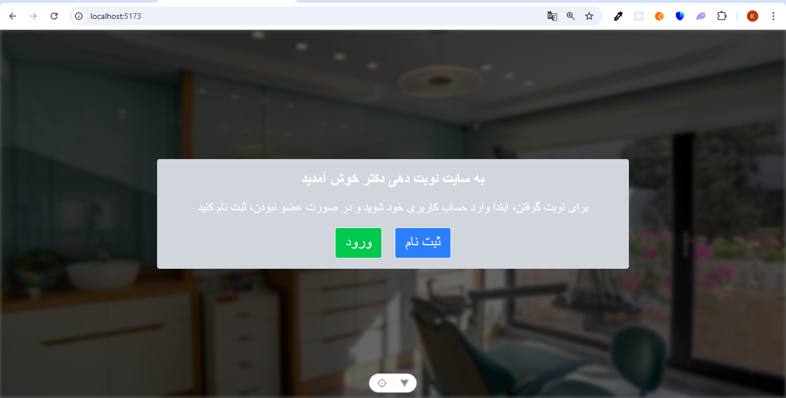
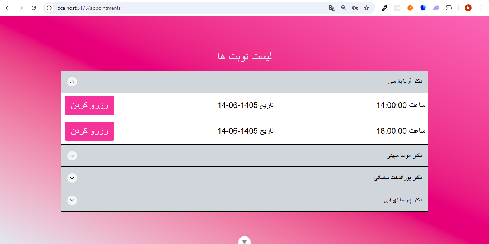
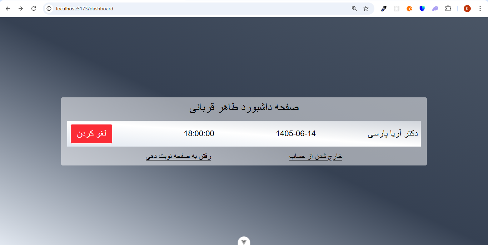

# Vue Articles Blog

A responsive doctor reservation application built with Vue 3, TypeScript, Pinia, Tailwind CSS.

## Features

* Display doctor reservation
* View doctor reservation details
* State management with Pinia
* Responsive UI
* Mock REST API with supabase

## Screenshots

### Home Page



### Appointments Page



### Dashboard Page



## Technologies

* Vue 3 (Composition API)
* TypeScript
* Pinia
* Vue Router
* Tailwind CSS
* Vite
* supabase-server

## Installation

```bash
npm install
```

## Run the development server

```bash
npm run dev
```

## Project Structure

```
src/
 ├── api/
 ├── assets/
 ├── components/
 ├── router/
 ├── screenshots/
 ├── stores/
 ├── types/
 └── utils/
 └── views/
```

## Future Improvements

* Dark mode
* Authentication
* Backend integration

## Author

Kourosh Ariayi
